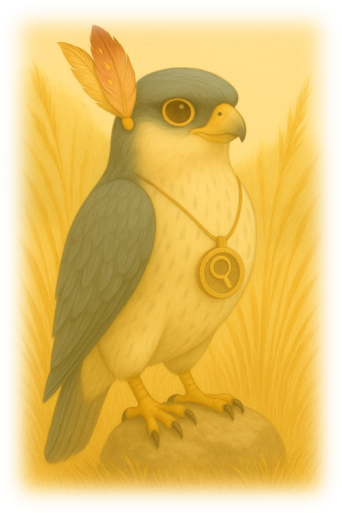
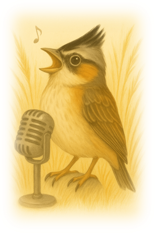

<!-- Imagen del pumita con laptop centrado -->

  

### Hello World!

- My name Shayla, but call me Shay.
- I'm a Softwafe Engineering student.
- A backend developer with experience in Java (SpringBoot) and C#(.NET).
- How to reach me: [shayla.choque.dev@gmail.com](mailto:shayla.choque.dev@gmail)

---

<table style="width:100%; border: 0px solid #ddd; border-radius: 8px; padding: 10px;">
  <tr>
    <td align="center" width="200">
      
    </td>
    <td style="width:50%; vertical-align: top; padding: 10px;">
      <h4>📚 Currently focused on:</h4>
      <ul>
        <li>🔐 Enhancing backend security</li>
        <li>🏗️ Applying clean architecture principles</li>
        <li>🧠 Diving deeper into data science</li>
        <li>🎨 Refining UX/UI design skills</li>
      </ul>
    </td>
    <td style="width:50%; vertical-align: top; padding: 10px;">
      <h4>🛠️ Core Tools & Technologies</h4>
      <ul>
        <li><strong>Backend:</strong> Java (Spring Boot), C# (.NET)</li>
        <li><strong>Frontend:</strong> Angular, Vue, JavaScript, HTML & CSS</li>
        <li><strong>Data Analysis:</strong> Python, R</li>
        <li><strong>Testing:</strong> Gherkin, JUnit, MSTest</li>
      </ul>
    </td>
    <td align="center" width="200">  
        
    </td>
  </tr>
</table>

---

> *"Ñanniyta Tarinaykama, Orqota Wasapanaykama, Sonqoywan Kushkachallasqapunin Puririsaq".*

---

#### ✨ Thank you for visiting my profile  
I'm on a continuous learning path, driven by the desire to explore and deepen my understanding of technologies that truly make a positive impact on people's lives. Through this space, I hope to share not only my progress and discoveries… but also the challenges that shape the journey.  

---
